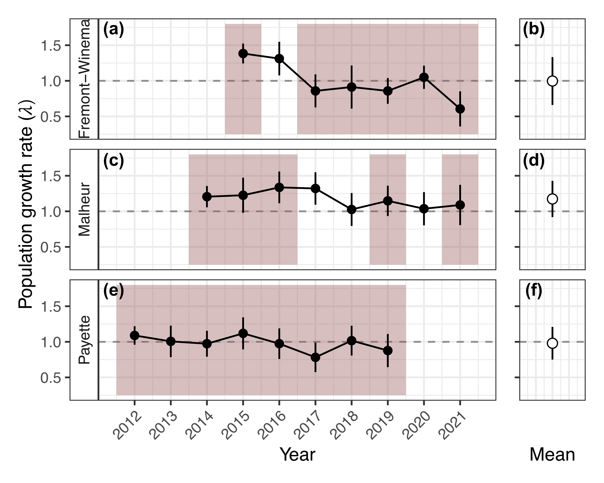
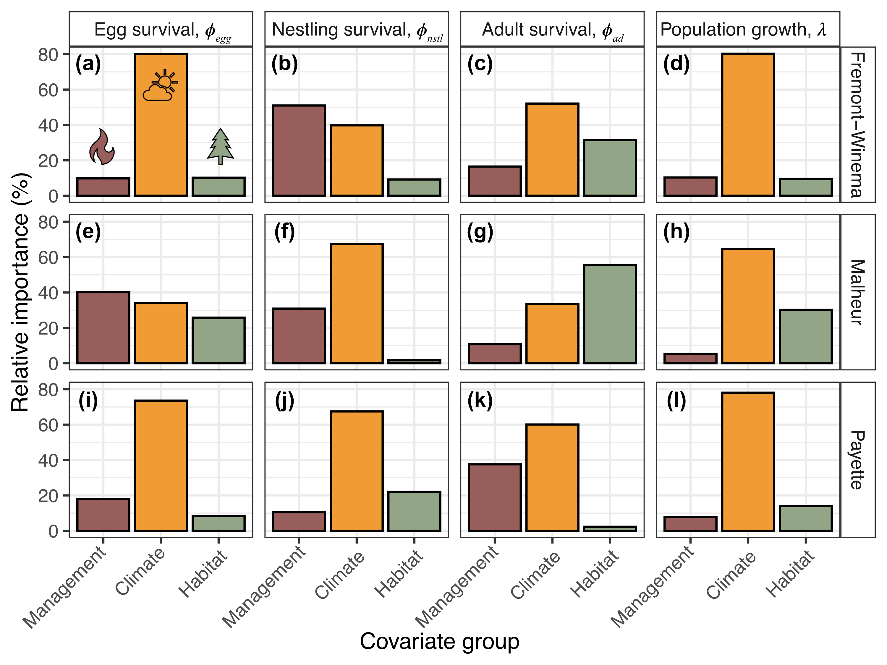
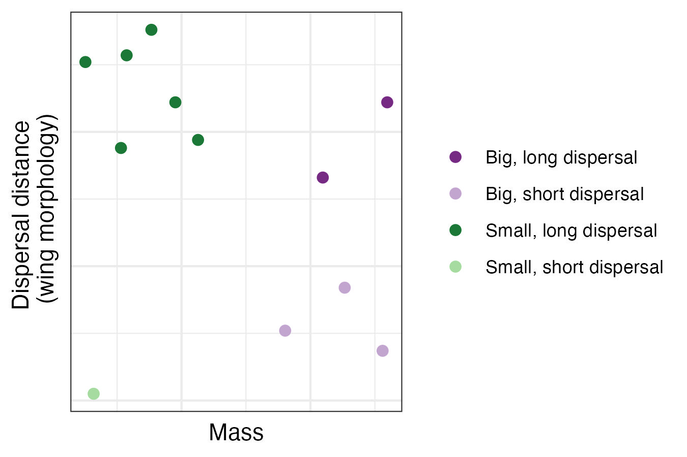
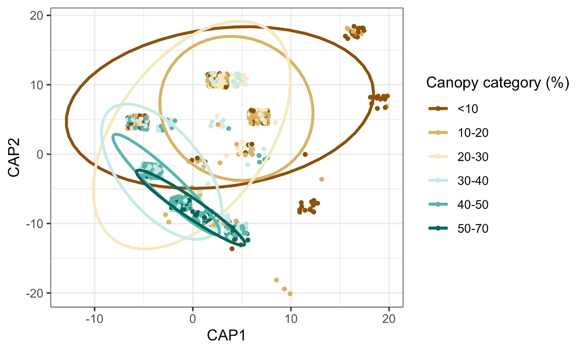

```{r setup, include=FALSE}

if (!require("pacman")) install.packages("pacman")
pacman::p_load(knitr)

knitr::opts_chunk$set(echo = F)
knitr::opts_chunk$set(warning = F)
knitr::opts_chunk$set(message = F)
```

```{=html}
<style>
body {text-align: left}
p.caption {
  font-size: 0.95em;
}
</style>
```

------------------------------------------------------------------------

My research spans a variety of research themes, with my primary focus on understanding community and population responses of wildlife to forest management, restoration, and climate change. This page outlines a few of my current research projects and links to my published work by theme. 

## 1. Bird population dynamics

In these projects, I use a variety of statistical models and dataset sources to explore population dynamics in bird populations. These projects involve long-term data from a variety of structured monitoring and participatory science outlets and aim to collate available information to understand drivers of trends in birds in a variety of landscapes. 

### 1.1 Relationships between seed availability and a declining seed diperser

In this project, we are examining relationships between declining pinyon jays and pinyon pine cone production across the Southwest USA. We're combining stochastic antecedent modeling to explore the temporal relationships between bird abundance and seed availability and exploring how climate and habitat context alter the dependency of pinyon jays on pinyon cones. We're using participatory ("citizen") science data from [eBird](https://ebird.org/home) in this project because this dataset has broad temporal and spatial coverage in this region. 

> Pinyon jays are most abundant during the nesting season in locations where they cached seeds in the previous year and there seem to be 3-4 year population effects from seed resource pulses.

```{r, echo=FALSE, out.width = '50%', fig.align='center', fig.cap = "Figure 1: Importance weights of different years of cone availability to the relationship between jay abundance and cones. The strongest effect is the year following cone production, when jays can be found near areas where they cached seeds the previous year. There is also a longer-term population signal of pinyon cone seed resource pulses."}
knitr::include_graphics("images/cone_weights.jpg")
```

> Pinyon jays rely more on cones during "stressful" climatic events and rely less on cones in more "favorable" habitat conditions. High-quality resources are more important when they are more rare; favorable habitat may increase food source diversity and competition among jays and other species of seed eaters.

```{r, echo=FALSE, out.width = '50%', fig.align='center', fig.cap = "Figure 2: Interaction plots between pinyon cone abundance and climate and habitat covariates for pinyon jay abundance. At high values of precipitation and maximum temperature, birds have stronger relationships with cone availability (a and b). Conversely, at high values of pinyon basal area or monsoonality (how much moisture a site receives during the monsoon season), birds rely less on pinyon cones (c and d)."}
knitr::include_graphics("images/interaction_plots.jpg")
```

are most abundant during the nesting season in locations where they cached seeds in the previous year and there seem to be 3-4 year population effects from seed resource pulses.

### 1.2 White-headed woodpecker populations under active management

> Prioritizing forest management that creates heterogenous patches of forested and unforested areas with a combination of burning and tree removal will likely increase white-headed woodpecker nesting success.

In [a study](pdfs/Miller-terKuile_FEM2023.pdf) published in _Forest Ecology and Management_ in 2023, we demonstrated that forest restoration treatments influence nesting ecology of white-headed woodpeckers, including when birds decide to start nesting and how well eggs and nestlings survive. Forest restoration influences the nesting ecology of white-headed woodpeckers, with different effects as nests age. 

```{r, echo=FALSE, out.width = '50%', fig.align='center', fig.cap = "Figure 3: Distributions of nesting dates, eggs, nestlings, and fledglings for white-headed woodpeckers."}
knitr::include_graphics("images/whwonests.jpg")
```

> White-headed woodpecker populations are stable under active management and more influenced by climate than management.

```{r, echo=FALSE, out.width = '60%', fig.cap = "Figure 4: White-headed woodpecker population growth rate, with years of active management highlighted in red.", fig.align='center'}

```

Combining data on these life stages and adult survival, we estimated that white-headed woodpecker populations are stable under active management. Further, climate seems most important to population growth and most life stages, but there is variation across populations. This variation highlights that forest restoration management has variable effects on populations depending on local habitat and climate context.

```{r, echo=FALSE, out.width = '60%', fig.cap = "Figure 5: Relative importance of different covariate groups to egg, nestling, and adult survival and overall population growth. Management has a much smaller influence than climate in most cases, but there is variation across life stages and populations.", fig.align='center'}

```


------------------------------------------------------------------------

## 2. Modeling community change

As a community ecologist, I am interested in how the environment shapes communities as a way to predict how ongoing and future Anthropogenic alterations shape biodiversity. My current work in community ecology combines concepts drawn from community ecology theory (e.g., beta diversity, functional diversity) as well as advanced modeling of large datasets using Bayesian statistics. 

### 2.1 Bird community ecology and forest restoration

> How has forest management influenced bird communities of wildlife across the western USA?

This project is a collaboration with researchers at the Rocky Mountain Research Station and US Forest Service land managers. In this project, we are compiling data from systematic bird surveys across the Western United States to understand how forest management influences community structure and function. We aim to generate trait-based approaches to understanding how forest management shapes bird communities and use this as a method for tracking community response and likely ecological outcomes of forest management in the past and future. This project integrates multiple large datasets ([IMBCR](https://www.birdconservancy.org/what-we-do/science/monitoring/imbcr-program/) bird surveys and [AVONET](https://onlinelibrary.wiley.com/doi/full/10.1111/ele.13898) trait database) and aims to quantify the effects of wildlife risk reduction. 

In a synthesis [study](pdfs/Miller-terKuile_FEE2025.pdf), my colleagues and I highlighted the need for explicit metrics of ecological integrity that include animal communities, especially in terrestrial systems. We proposed a general framework based on functional ecology and functional traits (traits of species that can influence their ecosystem) for developing general metrics of ecological integrity using animal communities. 


```{r, echo=FALSE, out.width = '60%', fig.cap = "Figure 6: There are a growing number of studies about ecological integrity, many of which explicitly describe animal communities (a). However, the majority of these studies are in aquatic environments (b).", fig.align='center'}
knitr::include_graphics("images/Figure_1.jpg")
```

Building on this and using a dataset of bird communities from Arizona and New Mexico, USA, we are exploring the functional richness and composition of seed dispersing birds in these landscapes. 

```{r, echo=FALSE, out.width = '60%', fig.cap = "Figure 7: Plotting trait space of two morphological traits that determine dispersal ability (wing morphology and mass) demonstrates that there are four distinct groups of seed dispersers with variable functional roles in this system. These four groups differ in the number and size of seeds they disperse (mass) and the distance they disperse these seeds on the landscape (wing morphology).", fig.align='center'}

```


```{r, echo=FALSE, out.width = '60%', fig.cap = "Figure 8: A plot of canopy cover of sites in the dataset and the number of functional groups in each of those conditions demonstrates that there is a peak in functional richness and medium-low canopy cover.", fig.align='center'}
knitr::include_graphics("images/funrich.png")
```


```{r, echo=FALSE, out.width = '90%', fig.cap = "Figure 9: Examining the composition of the sites in this dataset (functional groups and number of species in each of them) demonstrates that low canopy conditions have distinct disperser communities from high canopy conditions. At medium-low canopy, there is a transition state from the low- to high-canopy disperser community composition.", fig.align='center'}

```

------------------------------------------------------------------------

## 3. Published research themes

#### Forest management impacts forest ecosystems

[Miller-ter Kuile, A., et al. (2023)](pdfs/Miller-terKuile_FEM2023.pdf)

[Rodman, K. C., et al. (2024)](pdfs/Rodman_EcoApps2025.pdf)

[Parsons, J. et al. (2021)](pdfs/Parson_FEM2021.pdf)

#### Forest animals as metrics of post-management ecological integrity

[Miller-ter Kuile, A., et al. (2025)](pdfs/Miller-terKuile_FEE2025.pdf)

#### Invasive species and their eradications impact community and ecosystem structure and dynamics

[Preston, D., et al. (2021)](pdfs/Preston_FWE2021.pdf)

[Miller-ter Kuile, A., et al. (2020)](pdfs/Miller-terKuile_Biotropica2020.pdf) 

[Lafferty, K., et al. (2018)](pdfs/Lafferty_BL2018.pdf)

[Nigro, K., et al. (2017)](pdfs/Nigro_RE2017.pdf)

[Young, H., et al. (2017)](pdfs/Young_CJZ2017.pdf)

#### Long-term datasets and statistical techniques for tracking biodiversity change

[Miller-ter Kuile, A. et al. (2025)](pdfs/Miller-terKuile_GCB2025.pdf)

[Hardesty-Moore, M., et al. (2018)](pdfs/Hardesty-Moore_PTB2018.pdf)

#### Food webs are shaped by ecosystem productivity and traits

[Miller-ter Kuile, A., et al. (2022)](pdfs/Miller-terKuile_BL2022) 

[Miller-ter Kuile, A., et al. (2022)](pdfs/Miller-terKuile_Ecology2022.pdf)

[Young, H., et al. (2013)](pdfs/Young_Ecology2013.pdf) 

------------------------------------------------------------------------
