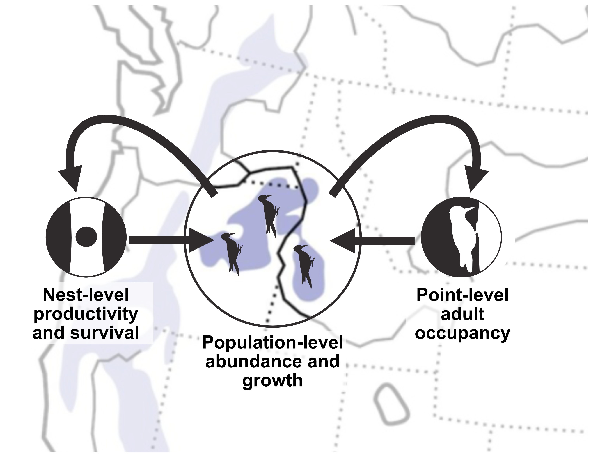
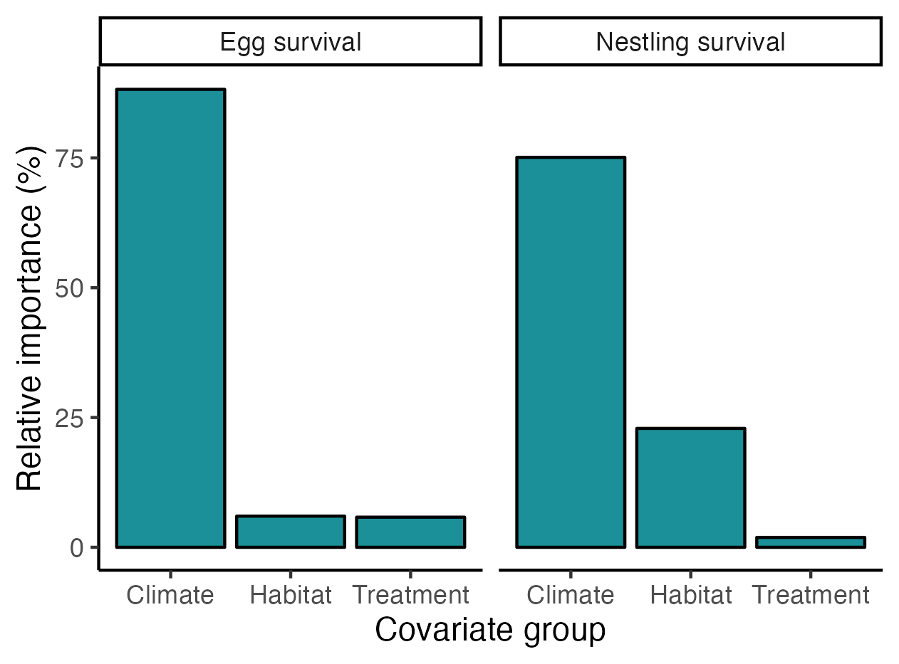
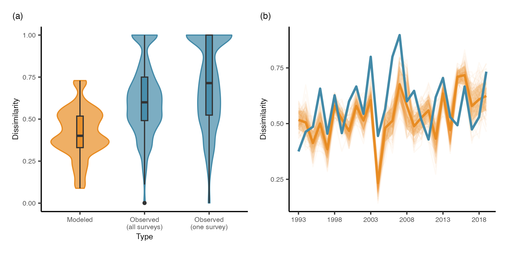
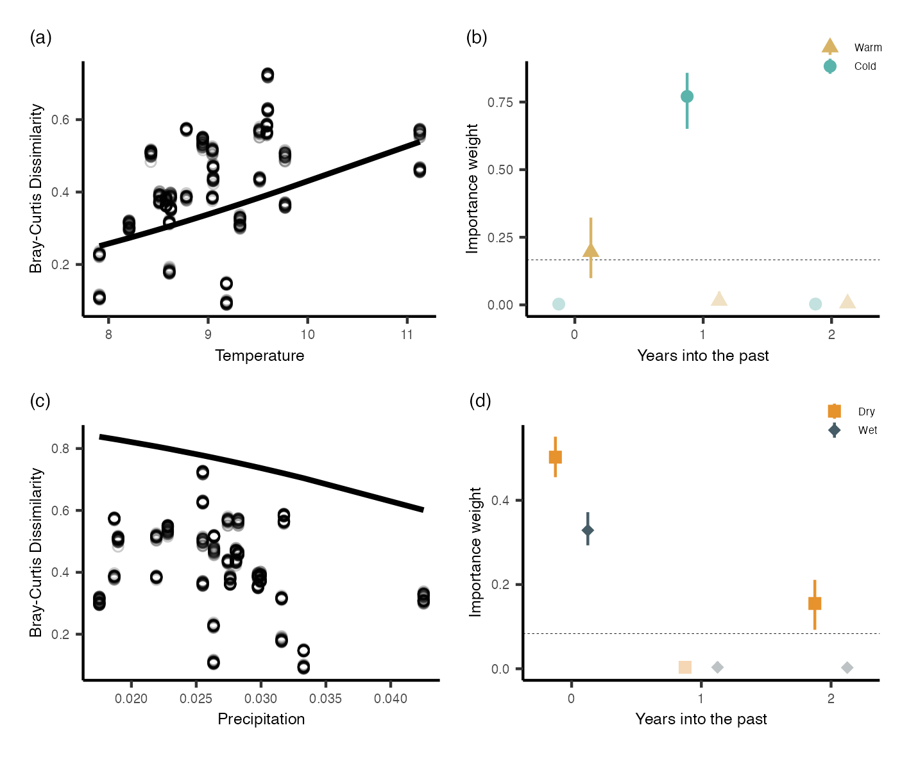
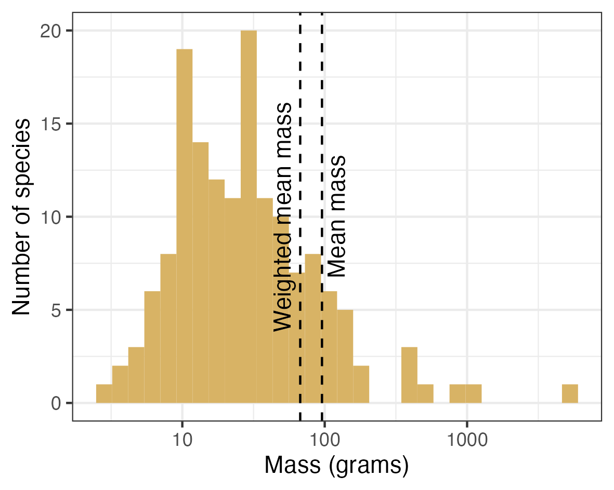
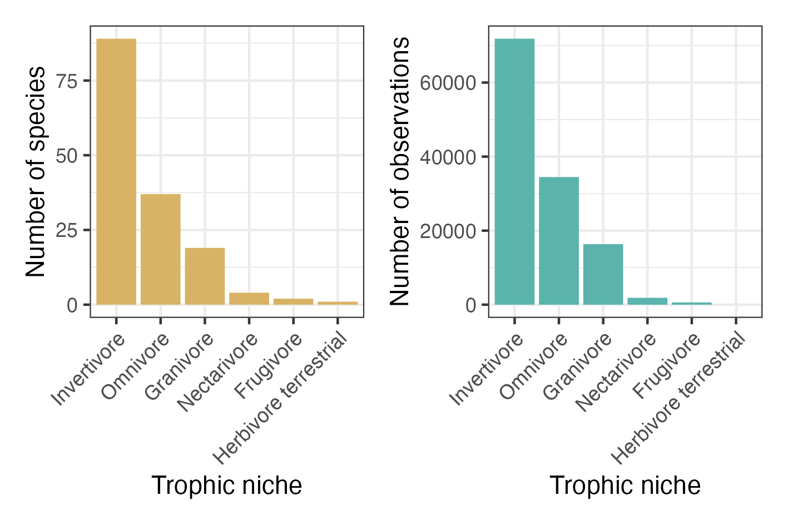

```{r setup, include=FALSE}

if (!require("pacman")) install.packages("pacman")
pacman::p_load(knitr)

knitr::opts_chunk$set(echo = F)
knitr::opts_chunk$set(warning = F)
knitr::opts_chunk$set(message = F)
```

```{=html}
<style>
body {text-align: left}
p.caption {
  font-size: 0.95em;
}
</style>
```

------------------------------------------------------------------------

## 1. Forest restoration and wildlife population dynamics

Forest restoration can impact wildlife populations, but may have variable effects depending on life stage. In this project, I am collaborating with researchers at Rocky Mountain Research Station and Northern Arizona University to examine the effects of forest restoration on a focal species, the white-headed woodpecker, in Oregon and Idaho. 

### 1.1 White-headed woodpecker nesting ecology

> Prioritizing forest management that creates heterogenous patches of forested and unforested areas with a combination of burning and tree removal will likely increase white-headed woodpecker nesting success.

In [a study](pdfs/Miller-terKuile_FEM2023.pdf) published in _Forest Ecology and Management_ in 2023, we demonstrated that forest restoration treatments influence nesting ecology of white-headed woodpeckers, including when birds decide to start nesting and how well eggs and nestlings survive. Forest restoration influences the nesting ecology of white-headed woodpeckers, with different effects as nests age. 

```{r, echo=FALSE, out.width = '50%', fig.align='center', fig.cap = "Figure 1: Distributions of nesting dates, eggs, nestlings, and fledglings for white-headed woodpeckers."}
knitr::include_graphics("images/whwonests.jpg")
```

### 1.2 White-headed woodpecker population trajectories

> How do the combined effects on all life stages influence population dynamics?

```{r, echo=FALSE, out.width = '60%', fig.cap = "Figure 2: Combining point-process data from multiple sources to inform population trajectories of white-headed woodpeckers.", fig.align='center'}

```

In the next stage of this project, we are combining data on adult and nesting stages into an integrated population model that will help us understand the population trajectories of white-headed woodpeckers, which life stages are shaping those trajectories, and how forest management intersects with other variables, such as climate, to shape populations in the future. 

```{r, echo=FALSE, out.width = '60%', fig.cap = "Figure 3: Relative importance of different covariate groups to egg and nestling survival. For these stages, climate is most important and forest treatment (burning and tree removal) is relatively unimportant relative to other variables.", fig.align='center'}

```
------------------------------------------------------------------------

## 2. Modeling community change

As a community ecologist, I am interested in how the environment shapes communities as a way to predict how ongoing and future Anthropogenic alterations shape biodiversity. My current work in community ecology combines concepts drawn from community ecology theory (e.g., beta diversity, functional diversity) as well as advanced modeling of large datasets using Bayesian statistics. 

### 2.1 Long-term community change - the roles of environmental variability and detection error

> Long-term community stability is higher when accounting for detection error in observation datasets and subject to immediate and lagged effects of environmental conditions. 

In this project, we are leveraging multiple long-term datasets (e.g., NSF-LTER sites, National Park Service Inventory and Monitoring) to understand how detection error in community datasets shapes our estimates of community stability (e.g., how much communities change) through time and then using modeled estimates of stability to explore how the environment shapes community change with both immediate and lagged effects. 

```{r, echo=FALSE, out.width = '90%', fig.cap = "Figure 4: Accounting for detection error reduces variation and magnitude of community change for an example dataset of grasshopper communities tracked in Sevilleta LTER between 1993 and 2019.", fig.align='center'}

```


```{r, echo=FALSE, out.width = '80%', fig.cap = "Figure 5: Grasshopper communities in Sevilleta LTER respond to both temperature and precipitation with immediate and lagged responses. Varying responses are likely related to a combination of physiology (e.g., overwintering success) and resource availability (e.g., lagged responses between plant and consumer population dynamics).", fig.align='center'}

```

### 2.2 Bird community ecology and forest restoration

> How has forest management influenced bird  communities of wildlife across the western USA?

This project is a collaboration with researchers at the Rocky Mountain Research Station and US Forest Service land managers. In this project, we are compiling data from systematic bird surveys across the Western United States to understand how forest management influences community structure and function. We aim to generate trait-based approaches to understanding how forest management shapes bird communities and use this as a method for tracking community response and likely ecological outcomes of forest management in the past and future. This project integrates multiple large datasets ([IMBCR](https://www.birdconservancy.org/what-we-do/science/monitoring/imbcr-program/) bird surveys and [AVONET](https://onlinelibrary.wiley.com/doi/full/10.1111/ele.13898) trait database) and aims to quantify the effects of wildlife risk reduction through the US Forest Service 10-year Wildfire Crisis Strategy. 

```{r, echo=FALSE, out.width = '60%', fig.cap = "Figure 6: Size distribution of species in a subset of the dataset including four National Forests in Arizona, USA.", fig.align='center'}

```


```{r, echo=FALSE, out.width = '90%', fig.cap = "Figure 7: In the Arizona landscape, most of the birds and the largest abundance of birds are insectivores. We could compare the number and size of insectivores across landscapes undergoing active management and those that are not to understand how forest management might change forest dynamics such as insect pest outbreaks.", fig.align='center'}

```

------------------------------------------------------------------------

## 3. Past projects

#### 3.1 Ecosystem productivity shapes food webs and predator-prey dynamics

[Miller-ter Kuile, A., et al. (2022)](pdfs/Miller-terKuile_BL2022) 

[Young, H., et al. (2013)](pdfs/Young_Ecology2013.pdf) 

#### 3.2 Species traits and identity shape food web structure

[Miller-ter Kuile, A., et al. (2022)](pdfs/Miller-terKuile_Ecology2022.pdf)

#### 3.3 Invasive species and their eradications impact community and ecosystem structure and dynamics

[Miller-ter Kuile A., et al. (2020)](pdfs/Miller-terKuile_Biotropica2020.pdf) 

[Lafferty, K., et al. (2018)](pdfs/Lafferty_BL2018.pdf)

[Nigro, K., et al. (2017)](pdfs/Nigro_RE2017.pdf)

[Young, H., et al. (2017)](pdfs/Young_CJZ2017.pdf)


------------------------------------------------------------------------
