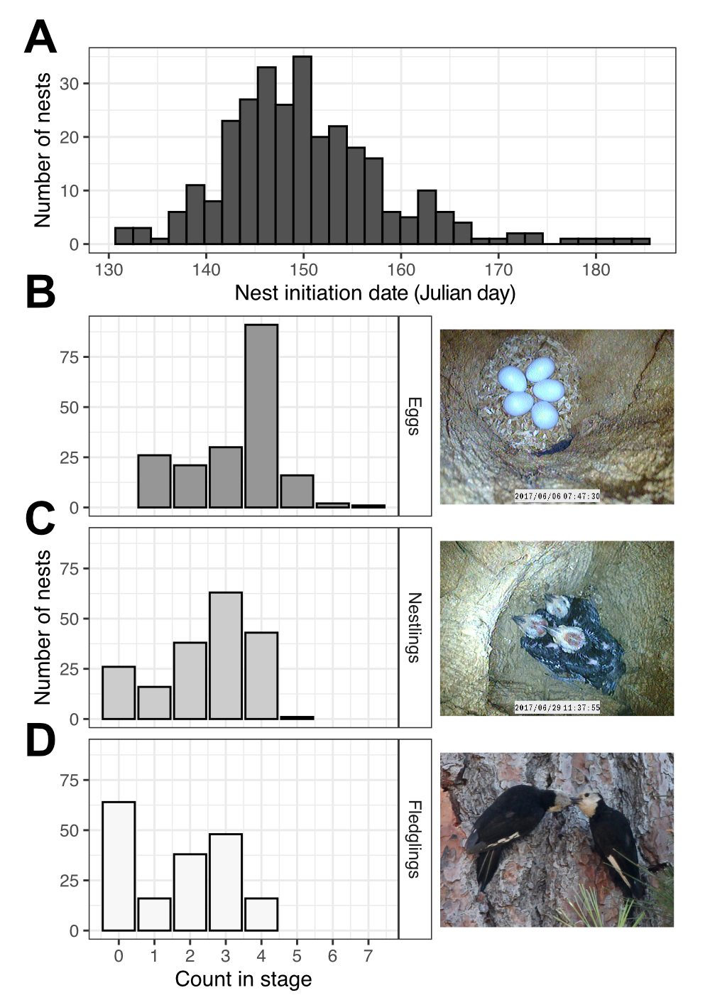

```{r setup, include=FALSE}

if (!require("pacman")) install.packages("pacman")
pacman::p_load(knitr)

knitr::opts_chunk$set(echo = F)
knitr::opts_chunk$set(warning = F)
knitr::opts_chunk$set(message = F)
```

```{=html}
<style>
body {text-align: left}
</style>
```

------------------------------------------------------------------------

## 1. Forest restoration and wildlife population dynamics

Forest restoration can impact wildlife populations, but may have variable effects depending on life stage. In this project, I am collaborating with researchers at Rocky Mountain Research Station and Northern Arizona University to examine the effects of forest restoration on a focal species, the white-headed woodpecker, in Oregon and Idaho. 

### White-headed woodpecker nesting ecology

> Prioritizing forest management that creates heterogenous patches of forested and unforested areas with a combination of burning and tree removal will likely increase white-headed woodpecker nesting success.

In [a study](pdfs/Miller-terKuile_FEM2023.pdf) published in _Forest Ecology and Management_ in 2023, we demonstrated that forest restoration treatments influence nesting ecology of white-headed woodpeckers, including when birds decide to start nesting and how well eggs and nestlings survive. Forest restoration influences the nesting ecology of white-headed woodpeckers, with different effects as nests age. 

```{r, echo=FALSE, out.width = '50%', fig.align='center', fig.alt = "Distributions of nesting dates, eggs, nestlings, and fledglings for white-headed woodpeckers."}

```

### White-headed woodpecker population trajectories

> How do the combined effects on all life stages influence population dynamics?

In the next stage of this project, we will combine data on adult and nesting stages into an integrated population model that will help us understand the population trajectories of white-headed woodpeckers, which life stages are shaping those trajectories, and how forest management intersects with other variables, such as climate, to shape populations in the future. 

```{r, echo=FALSE, out.width = '50%', fig.align='center'}
knitr::include_graphics("images/picture_ipm.png")
```

------------------------------------------------------------------------

## 2. Modeling community change

### Long-term community change - the roles of environmental variability and detection error

> How is long-term community stability shaped by the environment and our ability to detect species when they're there?

### Bird community ecology and forest restoration

> How has forest management influenced bird  communities of wildlife across the western USA?

------------------------------------------------------------------------

## 3. How species traits and identities shape trophic interactions

### The role of ecosystem productivity in shaping predator diets

> Environmental context alters some predator diets while other predators are less plastic.

### Species traits and identity and how it shapes food web structure

> Both body size and species identity shape predator diets.

----------------------------------------------------------

## 4. The impacts of invasive species eradications on ecosystem processes

> Eradicating invasive species in complex novel ecosystems leads to a variety of outcomes, including those that require further restoration interventions.

------------------------------------------------------------------------
